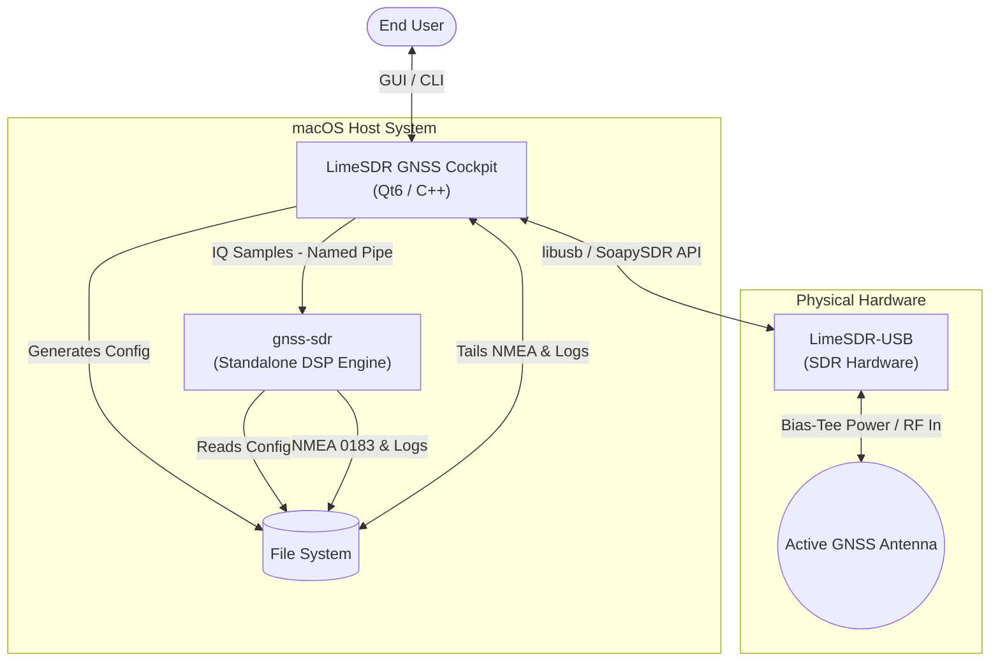
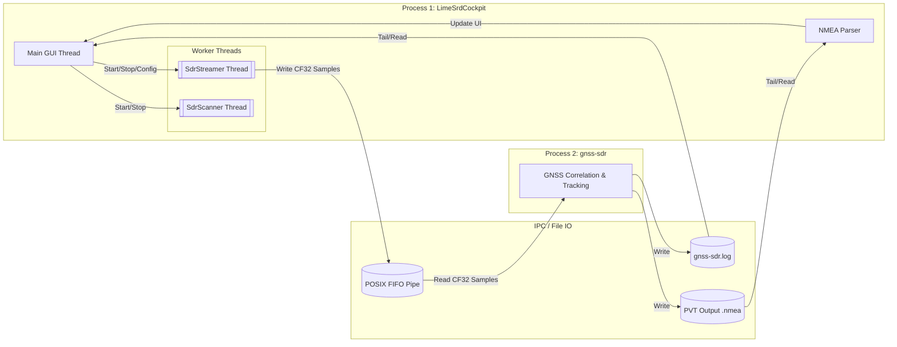
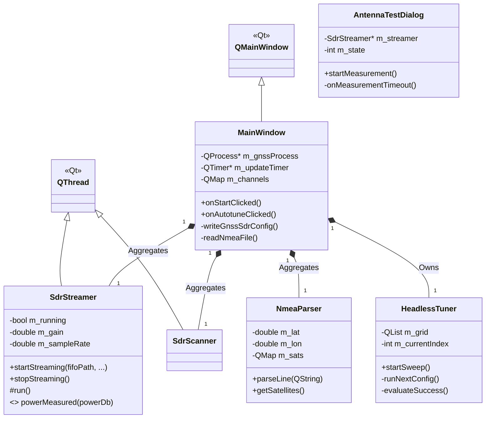
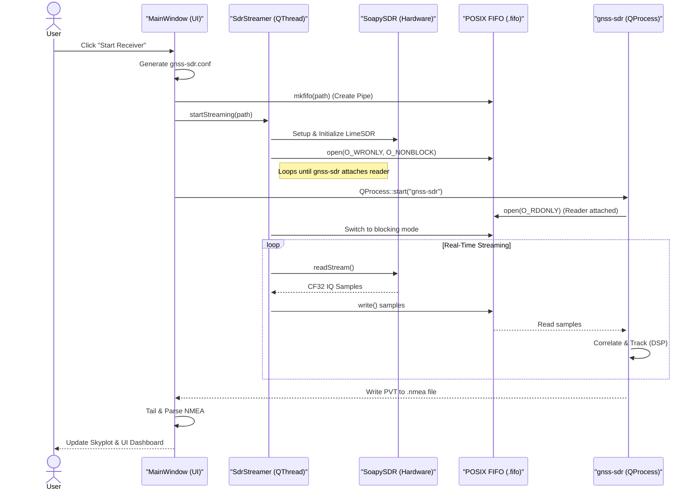
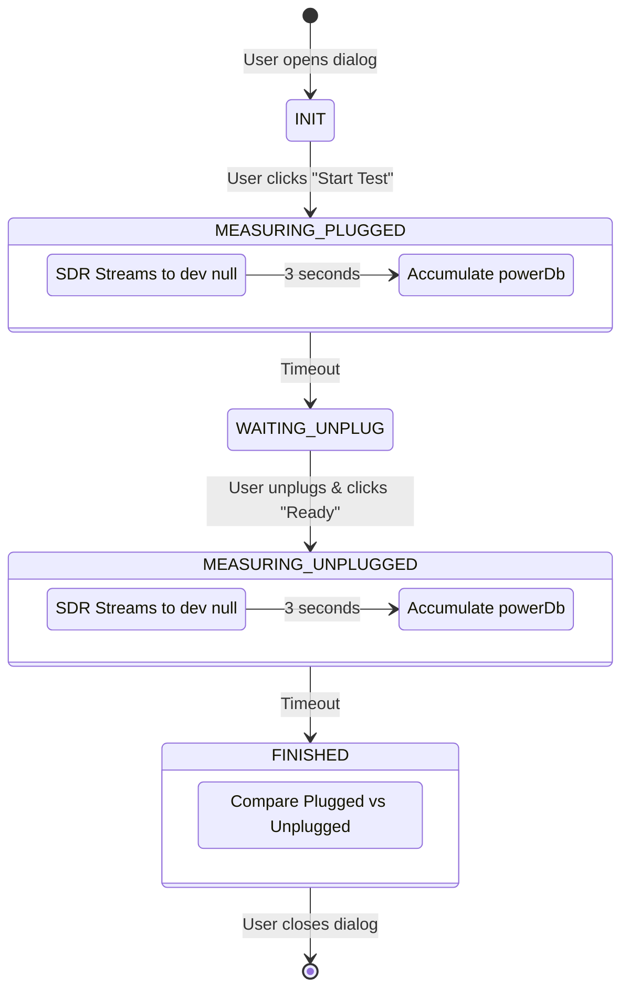

# Software Architecture & Specification
**Project:** LimeSDR GNSS Cockpit
**Version:** 1.1

## 1. Executive Summary

The **LimeSDR GNSS Cockpit** is a comprehensive macOS desktop application built with Qt6/C++. It serves as an orchestrator and graphical interface bridging low-cost SDR hardware (LimeSDR-USB) and the powerful `gnss-sdr` processing engine. It abstracts the complexity of RF signal acquisition, digital signal processing (DSP) tuning, and geospatial data visualization into an accessible suite of tools.

---

## 2. High-Level Architecture (System Context)

The High-Level Architecture describes how the Cockpit fits into the physical world, interacting with both the user and the external hardware/software dependencies.



### Key Interactions:
*   **User ↔ Cockpit:** The user provides inputs (Gain, Bandwidth, Tuning goals) and receives visual feedback (Skyplots, SNR).
*   **Cockpit ↔ LimeSDR:** The application configures the hardware (Center frequency, sample rate, digital gain) and pulls raw baseband IQ samples over USB 3.0.
*   **Cockpit ↔ gnss-sdr:** The Cockpit acts as a master process, dynamically generating configuration files, spawning the `gnss-sdr` subprocess, and feeding it raw data via a POSIX Named Pipe (FIFO).
*   **gnss-sdr ↔ Cockpit (Telemetry):** `gnss-sdr` writes its PVT (Position, Velocity, Time) solutions to a local `.nmea` file, which the Cockpit tails and parses in real-time.

---

## 3. Software Architecture (Process & IPC Model)

The software architecture relies heavily on multi-threading to ensure the UI remains responsive while processing high-bandwidth data (16 MB/s for 2 MSPS CF32). It also utilizes Inter-Process Communication (IPC) to decouple the heavy correlation math of `gnss-sdr` from the GUI.



### Concurrency Model:
1.  **Main Thread:** Handles all Qt event loops, widget painting, user interaction, and QTimer-based file tailing.
2.  **SdrStreamer Thread:** A dedicated `QThread` executing a blocking `readStream` loop against the SoapySDR API. It performs lightweight math (calculating overall RF power in dBFS) and pushes samples into the FIFO.
3.  **SdrScanner Thread:** A dedicated `QThread` used exclusively for the diagnostic scanner. It rapidly retunes the SDR frequency and pulls small buffers to construct an FFT-averaged spectrum.

---

## 4. Low-Level Architecture (Class Design)

The low-level design maps out the specific C++ classes and their relationships within the Qt framework.



### Core Components & Responsibilities:

*   **`MainWindow`:** The central controller. It initializes the UI components, instantiates the worker threads, and connects Qt Signals/Slots to route data (e.g., routing `powerMeasured` from the Streamer to the UI Label). It owns the `QProcess` that manages the `gnss-sdr` lifecycle.
*   **`SdrStreamer`:** The hardware abstraction layer for streaming. It configures the LimeSDR via SoapySDR (`setSampleRate`, `setFrequency`, `setGain`), opens the Named Pipe (with `O_WRONLY | O_NONBLOCK`), and runs a tight `while(m_running)` loop pulling buffers.
*   **`NmeaParser`:** A stateless string tokenizer. It receives raw lines from the tailing operation in `MainWindow`, matches NMEA prefixes (`$GNGGA`, `$GPGSV`), splits by comma, and populates data structures representing satellites (PRN, Elevation, Azimuth, SNR).
*   **`HeadlessTuner`:** An autonomous state machine. Instead of relying on user clicks, it holds a `QList` of configurations. It starts a configuration, waits a specified duration (e.g., 40 seconds), checks the NMEA parser for a 3D fix, logs the result to a CSV, and transitions to the next configuration.
*   **`AntennaTestDialog`:** A specialized QDialog that borrows an `SdrStreamer` instance to stream data to `/dev/null` temporarily. This isolates the SDR to measure thermal noise averages in two states (plugged vs unplugged).

```

### Data Flow Sequence Diagram

This sequence diagram illustrates the complex startup sequence and data flow pipeline when a user clicks the "Start" button in the Cockpit. It highlights how IPC is established using a POSIX named pipe before the SDR begins writing.



### Diagnostic State Diagram (Antenna LNA Test)

The `AntennaTestDialog` employs a state machine to orchestrate the measurement of thermal noise, temporarily taking over the SDR hardware to prove the LNA is active.



---

## 5. Functional Capabilities & Requirements

### 5.1 Real-Time Signal Processing
*   The system configures the SDR to sample at 2.0 MSPS (or 4.0 MSPS) centered at 1575.42 MHz (L1 band).
*   The system implements offset tuning (2 MHz) to avoid DC spike contamination in the center of the GPS band.
*   The system provides an option to enable the 3.3V Bias-Tee to power active GNSS antennas.

### 5.2 Dynamic Configuration & DSP Orchestration
*   The system dynamically generates a valid `gnss-sdr` configuration file (`gnss-sdr.conf`) matching the current hardware and GUI state (Gain, Bandwidths).
*   The system spawns `gnss-sdr` and monitors its stdout/stderr for status updates, catching pipeline errors or thread terminations.

### 5.3 Automated Headless Tuning (Grid Search)
*   A dedicated CLI mode (`--headless-tune`) bypasses the GUI to run an automated grid search.
*   The tuning engine iterates through combinations of RF Gain (45-65 dB), PLL Bandwidth (30-50 Hz), and DLL Bandwidth (1-3 Hz) to find optimal parameters for unstable clocks.
*   The tuning engine evaluates success based on the acquisition of a valid 3D NMEA fix and logs results to `tuning_results.csv`.

### 5.4 Hardware Diagnostics
*   **Antenna LNA Test:** Measures the thermal noise floor drop between a plugged and unplugged state to verify active antenna power.
*   **RF Spectrum Scanner:** Rapidly hops frequencies (e.g., 10 MHz to 3.8 GHz) to identify local out-of-band interference (like cellular or 5G bands).

---

## 6. Non-Functional Requirements

*   **Performance:** The UI thread must remain responsive at 60 FPS while the `SdrStreamer` thread processes 16 MB/s of incoming IQ data.
*   **Robustness:** The application must clean up all child processes (`gnss-sdr`) and POSIX FIFOs upon exit (SIGINT/SIGTERM) to prevent zombie processes and locked USB devices.
*   **Usability:** Complex DSP metrics (like C/N0 and lock state) must be distilled into intuitive visual representations (Polar Skyplots, color-coded status text).
